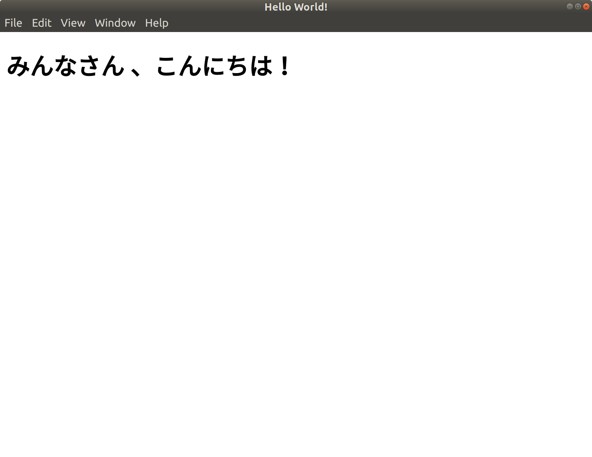

# Electron: HTML Localizer

Electron HTML Localizer is a tool allowing you to easily localize HTML text inside your Electron application dynamically during rendering.
* Designed to work out-of-the-box with Electron
* Lightweight simple localization module using JSON
* Automatically loads localized texts based on the system's locale 
* Automatically translate HTML texts within _<localized-text>_ tag (tag's name can be customized)
* Uses common __('...') syntax
* Loads language files in json files
* No extra parsing needed

# Installation

Run the following:
```
npm install electron-localizer
```

# Usage

Create a new directory at the root of your project and name it _locales_. Within the directory, create a _default.json_ file with all the default text for your application:

```json
{
    "Hello World!": "Hello World!"
}
```

For each language you wish to provide translation, create within the _locales_ directory a JSON file named _{Language Code}.json_ (example: _ja.json_ if you want to support Japanese locale) and add the translated texts in this file:

```json
{
    "Hello World!": "みんなさん 、こんにちは！"
}
```

[Here is the list of all Language Codes supported by Electron](https://electronjs.org/docs/api/locales)

Next, load the module at the top of your HTML page:

```html
<script>
    var localizer = new (require('electron-localizer'))();
</script>
```

The module will fetch the system's current locale and load the locale JSON file accordingly. If it can't find a translation file matching the locale name, it will load _default.json_ file.

You're now ready to localize any HTML page inside your page! To do that, surround any text you want to localize with the tag _<localized-text>_.

```html
<h1><localized-text>Hello World!</localized-text></h1>
```

If the module can find inside the dictionary a key that matches, it will automatically replace the text by its value.

# Example

Inside _example_, you will find the _electron-quick-start_ project using this library to localize the _Hello World!_ text.
After adding _ja.json_ including its Japanese translation inside the _locales_ directory, here is an overview of the HTML code:

```html
<!DOCTYPE html>
<html>
  <head>
    <meta charset="UTF-8">
    <title>Hello World!</title>

    <script>
      // Load module and instantiate
      var localizer = new (require('electron-localizer'))();
    </script>
  </head>
  <body>
    <h1><localized-text>Hello World!</localized-text></h1>

    <script>
      // Can be used in Javascript too
      console.log(localizer.__("Hello World!"));
    </script>
  </body>
</html>
```

This is the result when running this Electron application on a Japanese system:



# Configuration

When you instantiate a new Localizer object, there are a few options available that you can pass in via a dictionary:

### locale

Set manually the locale to use and load. 
_Default: fetch and use the system's locale._

### locales_directory

Set the path to directory containing the localized text JSON files.
_Default: locales/_

### locale_default

Set locale to load by default if not available.
_Default: default_

### localized_tag

Set HTML tag name for localized text (must include a hyphen!).
_Default: localized-text_

Example:
```javascript
// Initialize with custom options
var options = {
    locale: 'ja',
    locales_directory: 'another/folder/locales/',
    localized_tag: 'my-tag'
}
var localizer = new (require('electron-localizer'))(options);
```

## Changelog

* 0.1.0: first release
